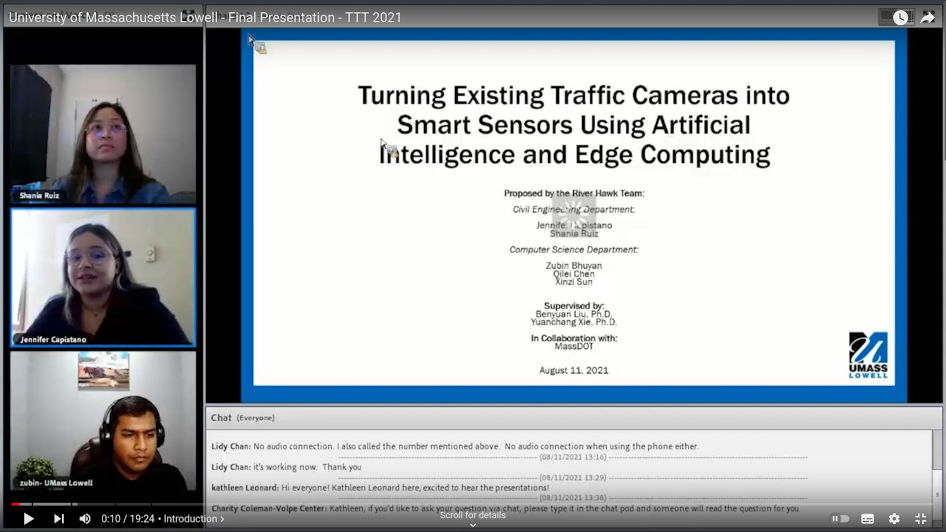
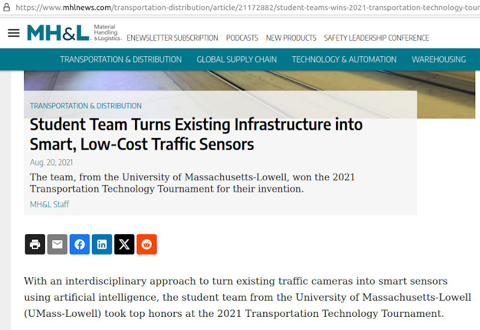

### University of Massachusetts Lowell Wins 2021 Transportation Technology Tournament
[TTT Awards Ceremony](https://www.youtube.com/watch?v=cSyakQG-fPg)

# Team River Hawk - Transportation Technology Tournament 2021 Winner

<table>
  <tr>
    <td> </td>
    <td> </td>
   </tr> 
   <tr>
      <td><i> Final Presentation Video (https://www.youtube.com/watch?v=kllPMsbjloI) </i> </td>
      <td><i>University of Massachusetts Lowell Wins 2021 Transportation Technology Tournament.</i>  </td>
  </tr>
</table>

## Problem Statement
Massachusetts DOT (MassDOT) has deployed numerous traffic cameras on major highways, primarily used for manual incident verification. This project aims to leverage artificial intelligence (AI) to transform these cameras into smart sensors, automatically analyzing videos to identify abnormal scenarios, extract traffic flow parameters, and generate alerts.

## Solution Overview
The solution focuses on maximizing the use of existing ITS infrastructure by employing AI technologies. The proposed system utilizes MassDOT's traffic surveillance cameras to collect key traffic parameters automatically, including speed, time headway, lane changes, and traffic count by vehicle class. This data enhances real-time incident detection and provides critical information to support connected and automated vehicles.

### Features:
- **Incident Detection**: Automatic identification of incidents triggering immediate alerts.
- **Data Collection**: Continuous streaming of processed data to the Highway Operations Center, reducing communication costs.
- **Edge Deployment**: Algorithms deployed at the edge, eliminating the need to stream entire videos unless necessary.

### Benefits:
- Cost-effective use of existing infrastructure.
- Real-time incident detection with additional critical information.
- Reduction in data communication costs through processed data streaming.

### Concept of Operations
[Concept of Operations (PDF)](https://transops.s3.amazonaws.com/uploaded_files/2023-10/UMass%20Lowell%20Presentation%20-%202021%20TTT.pdf)

## Videos
- [Final Presentation Video](https://www.youtube.com/watch?v=kllPMsbjloI)

- [TTT Awards Ceremony](https://www.youtube.com/watch?v=cSyakQG-fPg)
  

  

## Team Members
- Zubin Bhuyan
- Xinzi Sun
- Qilei Chen
- Jennifer Capistano
- Shania Ruiz

[Team Members Information](https://transportationops.org/umass-lowell-2021-student-information)

## Faculty Advisors
- [Yuanchang Xie, PhD](https://www.uml.edu/engineering/civil-environmental/faculty/xie-yuanchang.aspx)
- [Benyuan Liu, PhD](https://www.uml.edu/research/chords/faculty/liu-benyuan.aspx)

## News & Recognition
[Student Team Turns Existing Infrastructure into Smart, Low-Cost Traffic Sensors](https://www.mhlnews.com/transportation-distribution/article/21172882/student-teams-wins-2021-transportation-technology-tournament)

[University of Massachusetts Lowell Wins 2021 Transportation Technology Tournament](https://transportationops.org/news/headline-news/university-massachusetts-lowell-wins-2021-transportation-technology-tournament)

## Tournament Overview
With an interdisciplinary approach, the student team from University of Massachusetts-Lowell (UMass-Lowell) secured top honors at the 2021 Transportation Technology Tournament. Their winning presentation can be found [here](https://www.youtube.com/watch?v=kllPMsbjloI).

The annual Transportation Technology Tournament challenges student teams to solve real-world transportation problems by leveraging existing infrastructure and maximizing the use of operations and Intelligent Transportation Systems (ITS) strategies. The tournament, a partnership of the U.S. Department of Transportation’s ITS Joint Program Office Professional Capacity Building Program (ITS JPO PCB) and the National Operations Center of Excellence (NOCoE), aims to build on transportation curriculums by teaching problem-solving, communications, and team-building skills with students from various educational backgrounds.

The winning team from UMass-Lowell featured students from both civil engineering and computer science programs, proposing equipping existing traffic video cameras with automated data collection and incident detection features; exemplifying how low-cost solutions can easily retrofit legacy ITS equipment to maximize both service life and benefits.

---

Congratulations to Team River Hawk for their outstanding performance at the 2021 Transportation Technology Tournament! 
